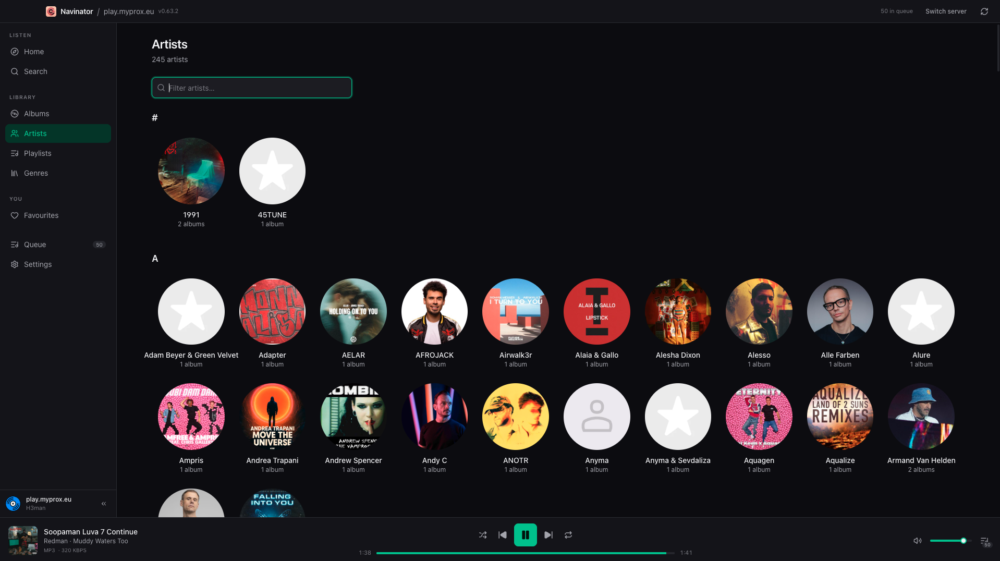
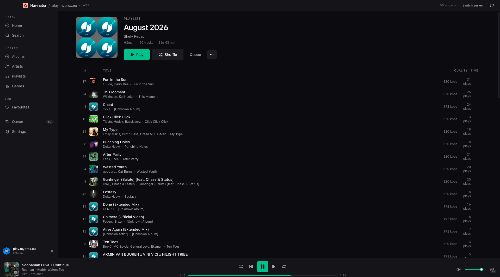
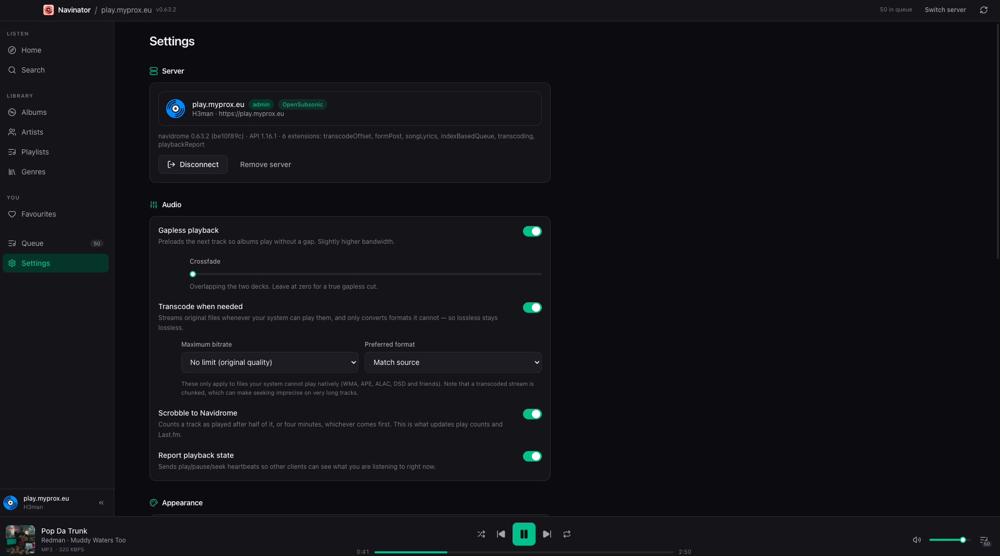
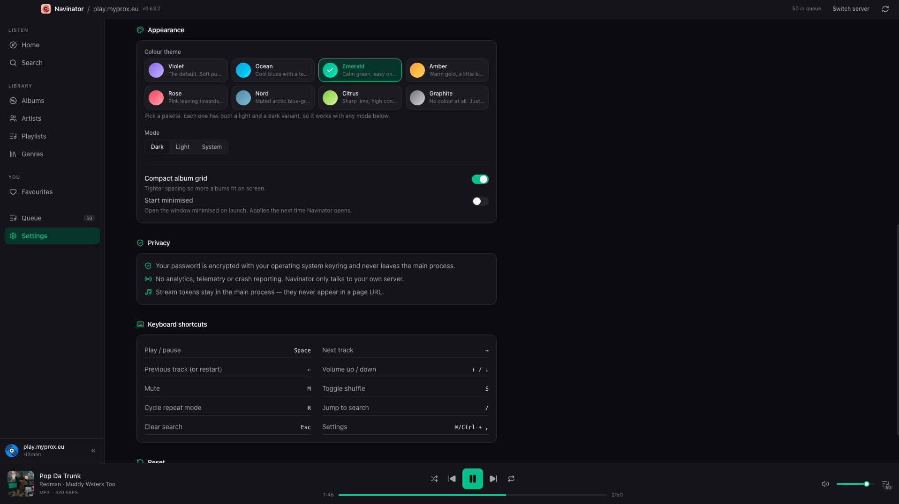

<div align="center">


# Navinator

**A desktop client for [Navidrome](https://navidrome.org) that treats your music library like it belongs on your machine — not like a web page with a wrapper around it.**

Electron 44 · React 19 · TypeScript · Tailwind v4 · macOS / Windows / Linux

[](LICENSE)
[](https://opensubsonic.netlify.app/docs/)
[](#)

Open source, MIT licensed. Built by [Robindoris](https://github.com/Robindoris) — issues and pull requests welcome at [github.com/Robindoris/navinator](https://github.com/Robindoris/navinator).

</div>

---

<table>
<tr>
<td width="50%"></td>
<td width="50%"></td>
</tr>
<tr>
<td align="center"><sub><b>Artists</b> — the full index, A–Z, filterable client-side.</sub></td>
<td align="center"><sub><b>Playlist</b> — 50 tracks, per-track bitrate and play counts, gapless playing throughout.</sub></td>
</tr>
<tr>
<td width="50%"></td>
<td width="50%"></td>
</tr>
<tr>
<td align="center"><sub><b>Server + Audio</b> — handshake details, gapless, crossfade, and selective transcoding.</sub></td>
<td align="center"><sub><b>Appearance + Privacy</b> — 8 palettes × 3 modes, and what the app promises not to do.</sub></td>
</tr>
</table>

> Screenshots are a live instance: Navidrome `0.63.2` behind a reverse proxy on a sub-path, which is the exact deployment that breaks naive clients. Nothing in the screenshots is mocked.

---

## Why this exists

Most Subsonic clients in 2026 are Electron shells around a web UI, and they share four problems. Navinator is built specifically to not have them.

### 1. Albums play with an audible gap — unless you build for it

Every browser pauses between tracks. A single `<audio>` element therefore produces a ~100 ms hole at every album boundary, which is exactly the artifact gapless formats exist to remove.

Navinator runs a **two-deck engine** ([`src/renderer/src/player/engine.ts`](src/renderer/src/player/engine.ts)). Two `HTMLAudioElement`s; the idle deck quietly preloads the next track, and on `ended` the decks swap. Crossfade is layered on top as a `requestAnimationFrame` gain ramp on the outgoing deck (0–8000 ms), so a 6-second crossfade genuinely overlaps the tracks instead of hard-cutting between them.

No audio library is used, deliberately. Howler has been unmaintained since 2023, and the native element is the only way to get Chromium's complete codec support — which matters because of point 2.

### 2. "Lossless" clients that transcode everything to 320 kbps MP3

A typical client asks the server to transcode the whole library. Navinator asks for a transcode **only when Chromium genuinely cannot decode the file**:

```ts
// src/shared/media.ts
const CHROMIUM_DECODABLE = new Set([
  'mp3', 'aac', 'm4a', 'm4b', 'mp4',
  'oga', 'ogg', 'opus', 'spx',
  'flac', 'wav', 'wave',
  'webm', 'weba', 'mka'
])
```

A 24-bit FLAC streams untouched. WMA, APE, ALAC and DSD get transcoded, and only they. An unknown or missing suffix is assumed playable, because forcing a transcode on every track over one missing metadata field is far more disruptive than the failure it prevents.

Transcoded requests are honest about their cost: the settings page warns that a transcode is a chunked stream, so seeking inside it is approximate.

### 3. Stream tokens ending up in page URLs

The renderer never talks to your Navidrome host directly. Every authenticated call is forwarded to the main process over **one** IPC channel and re-validated against an allow-list of 60 endpoints ([`src/shared/api-methods.ts`](src/shared/api-methods.ts)). The main process holds the credentials, mints a salted `md5(password + salt)` token, and serves the result as plain data.

Audio and artwork are proxied through a custom privileged scheme:

```
renderer  →  navinator://media/song?id=abc&transcode=1   →  main process
                                                          →  net.fetch(real Subsonic URL)
```

The renderer therefore never holds a credential, never needs CORS (a self-hosted Navidrome behind nginx frequently does not forward `Access-Control-*`), and gets real streaming with byte-range support because `net.fetch` is used rather than a buffered `Response`. Range headers are forwarded, so seeking hits the server instead of forcing a full-body buffer.

The app document itself is served from `navinator://app/`, deliberately **not** `file://`. A `file://` document has an opaque origin, so `'self'` in `script-src` matches nothing and a strict CSP blocks every script. Serving over a real origin is what lets [`src/renderer/index.html`](src/renderer/index.html) ship a CSP with zero remote origins.

### 4. Passwords sitting in plaintext JSON

They don't. [`src/main/config.ts`](src/main/config.ts) stores them through Electron's `safeStorage`, so the OS keychain does the work — Keychain on macOS, DPAPI on Windows, libsecret/kwallet on Linux. The Settings page says which of the three is active.

On Linux, if no real secret service is present Electron falls back to encrypting with a hardcoded password. Navinator detects that specific backend and **refuses to pretend**: it warns you by name instead of silently storing something that isn't protection.

---

## Features

Everything below is wired to actual UI in the current tree.

**Browsing**
- Home with *Recently added*, *On repeat* (most played), and a one-click *Shuffle recently added*
- Albums, sortable 8 ways: newest, name, artist, year, most played, recently played, top rated, random — **paged 100 at a time**, loading more as you scroll
- Artists, alphabetised with a client-side filter; artist pages resolve the full discography
- Genres, with per-genre play / shuffle / queue
- Search across artists, albums, songs and playlists (`search3`, debounced 250 ms, fires at ≥ 2 characters)
- **Multi-disc albums** are grouped into real disc sections, and still play in absolute track order

**Your library**
- Starred songs, albums and artists, in three separate sections
- Favourites updates optimistically across the whole query cache, and rolls back on failure
- Multiple servers saved side by side, switchable from the title bar
- Your last-used server reconnects automatically on launch

**Playback**
- Two-deck gapless, with optional 0–8000 ms crossfade
- Shuffle, and a three-state repeat (`off → all → one`)
- Editable, **drag-to-reorder** queue, persisted to the server roughly every 15 seconds
- **Your queue comes back** on launch, resumed at the position you left it
- Scrobbling at half the track or four minutes, whichever comes first
- OpenSubsonic `playbackReport` heartbeats every 20 seconds while playing
- Selective transcoding with a bitrate ceiling and format preference
- **Synced lyrics**, including word-level highlighting and click-to-seek, in a side panel
- **1–5 star ratings**, optimistic on every track list
- **Internet radio plays in-app** and queues like anything else
- Full OS media-key integration — hardware play/pause/next/prev/seek, with artwork and a working OS scrubber

**Playlists**
- Create (with description and public flag), rename, edit and delete
- **Add to playlist** from any track list, or create one pre-seeded on the spot
- **Drag to reorder** the tracklist
- Per-track download of the original file
- Per-track removal, starring and rating

**Interface**
- 8 colour palettes (Violet, Ocean, Emerald, Amber, Rose, Nord, Citrus, Graphite), each with a light and a dark variant
- Dark / Light / System, following `prefers-color-scheme` live with no flash of the wrong palette
- Compact album grid, a settings toggle that actually changes the grid
- Press `?` anywhere for the full keyboard reference
- Collapsible sidebar, collapsible native title bar, code-split routes
- **Automatic updates**, opt-out in Settings, downloaded but never installed without asking

### Keyboard

| Key | | Key | |
|---|---|---|---|
| `Space` | Play / pause | `M` | Mute |
| `→` | Next track | `S` | Toggle shuffle |
| `←` | Previous / restart | `R` | Cycle repeat mode |
| `↑` `↓` | Volume | `/` | Jump to search |
| `Esc` | Clear search | `⌘/Ctrl` `,` | Settings |
| `?` | Shortcut reference | `⌘/Ctrl` `⇧` `→` `←` | Seek ±10s |

Shortcuts stand down whenever a text field has focus or ⌘/Ctrl is held, so OS chords keep working.

---

## Getting started

You need **Node 20 or newer** and a reachable Navidrome (or any other Subsonic/OpenSubsonic) server. You do not need to run Navidrome locally — point it at your existing one.

```bash
git clone https://github.com/Robindoris/navinator.git
cd navinator
npm install
npm run dev
```

The window opens on a connect screen. Paste a server address — `music.example.com`, `https://music.example.com`, or `https://example.com/navidrome` for a sub-path mount all work; the scheme is inferred and trailing slashes are stripped. Credentials are **verified with a `ping` before anything is written to disk**, so a typo is caught while you are still looking at the form rather than after a silent failure.

### Scripts

| Command | What it does |
|---|---|
| `npm run dev` | Vite dev server + Electron with HMR |
| `npm run build` | Typecheck, then build main / preload / renderer into `out/` |
| `npm run typecheck` | `tsc --noEmit` across both the node and web projects |
| `npm start` | Preview a production build without packaging |
| `npm run package` | Unpacked app in `release/`, for a quick check |
| `npm run dist` | Full installers: DMG + zip (mac), NSIS + zip (win), AppImage + deb (linux) |
| `npm run icons` | Regenerate all icons from `resources/navinator.png` |

### Releases

Tagged builds go out through GitHub Actions — macOS (Intel + Apple Silicon), Windows (Intel + ARM64) and Linux (x86-64 + ARM64) from one tag:

```bash
git tag v0.1.0
git push origin v0.1.0
```

Installers and update feeds are published to [github.com/Robindoris/navinator/releases](https://github.com/Robindoris/navinator/releases). Signing, notarisation and the required repository secrets are documented in [RELEASING.md](RELEASING.md).

### Packaging notes

- `electron-builder.yml` excludes `resources/` from the packaged files — it is build input only, and nothing loads from it at runtime.
- macOS builds use a hardened runtime with `resources/entitlements.mac.plist`. Because the app is unsigned locally, macOS will still need the usual right-click → Open on first launch.
- The GitHub `publish:` target is configured for `Robindoris/navinator`. `npm run dist` publishes a release there, and the built-in updater reads that feed — so a version bump plus a publish is all an update takes.
- `appId` is `app.robindoris.navinator`. It is baked into installs and keys the OS keychain, so it must not change once anyone has installed a build.
- Linux `desktop` entries in electron-builder 26 accept only `desktopActions` and `entry`.

---

## Architecture

Three processes, one narrow bridge between them.

```
src/
├── main/                 Node side. Owns the connection and all secrets.
│   ├── index.ts            IPC surface, write queue, lifecycle, single-instance lock
│   ├── server.ts           the one live Subsonic connection + salted token minting
│   ├── protocol.ts         the navinator:// handler — app assets and media proxy
│   ├── config.ts           navinator.json, safeStorage, atomic writes
│   ├── window.ts           BrowserWindow, CSP, navigation lockdown
│   ├── updater.ts          electron-updater wrapper; pushes state to the renderer
│   └── menu.ts             native menu and its accelerators
│
├── preload/index.ts     54 lines. The entire privileged surface.
│
├── shared/              Imported by all three; no Electron, no DOM.
│   ├── api-methods.ts      the endpoint allow-list
│   ├── media.ts            scheme, URL builders, decode allow-list
│   ├── ipc.ts              the IPC contract
│   ├── types.ts            domain types and default settings
│   ├── shortcuts.ts        every keybinding, listed once
│   └── themes.ts           palette metadata
│
└── renderer/           No Node access whatsoever.
    ├── src/player/         two-deck engine, shortcuts, OS media session
    ├── src/store/          zustand: server, settings, player, updates
    ├── src/features/       one directory per route
    └── src/components/     layout, items, ui primitives
```

A few decisions worth knowing before you change things:

**Writes are serialised.** The renderer fires scrobbles and playlist edits without awaiting them, and Subsonic servers apply requests in arrival order. Every mutating method is chained onto a single promise chain in [`src/main/index.ts:26`](src/main/index.ts), so a `star` can't overtake the `scrobble` that was issued before it. A rejected write is swallowed on the chain so one failure doesn't poison everything after it.

**The method name is untrusted.** `api:request` takes a method name as a string from the renderer, so it is re-validated against the allow-list in the main process. Without that check, a compromised renderer could reach `custom` (an arbitrary-endpoint escape hatch) and anything else on the client. Methods returning binary media are rejected outright and must be requested through `navinator://` instead, since a `Response` cannot cross the IPC boundary.

**The config is written atomically.** A 200 ms debounce, then write-to-temp and `rename`. A crash mid-write cannot truncate your servers list. A corrupt config also never blocks launch — it degrades to defaults.

**Artist discographies are capped on purpose.** `getArtist` returns album stubs, so the real tracks need one `getAlbum` per album. "Play all" takes one album; shuffle and queue cap at 10–25 albums to avoid firing hundreds of requests at once.

**Routing is hash-based.** The packaged app loads over `navinator://`, where the History API cannot rewrite paths.

---

## Known gaps

Still worth being explicit about:

- **Not signed or notarised.** First launch on macOS requires right-click → Open. Auto-update is wired up, but it has nothing to fetch until a release is published under the `Robindoris/navinator` GitHub releases feed.
- **No tests.** There is no test runner in the project. The invariants that mattered most — the write ordering, the endpoint allow-list, the decode table — are enforced by types and comments rather than assertions, which is weaker than it should be.
- **The media proxy has no offline behaviour.** With no connection, every `navinator://` request returns 503 rather than a placeholder, so artwork blanks out while a server is unreachable.
- **Genre views are still capped at 500 songs.** Album lists and search are paged, but `getSongsByGenre` is a single call with a fixed count.
- **The queue does not survive a server switch.** A restored queue is tied to one server; switching servers clears it, because the track ids mean nothing on the new one.
- **Radio is queued but not scannable**, so a station never advances Navidrome's play counts or feeds the "now playing" view. The stream URL is also opaque to Navidrome, so track-level quality settings do not apply to it.
- **The transcript of a restored queue position is approximate** for transcoded streams, because a chunked transcode cannot seek precisely.

---

## Privacy

- No analytics, no telemetry, no crash reporting. There is no code in this repo that phones home; the only outbound requests are to the server you configured.
- Passwords are encrypted with your OS keyring and never leave the main process.
- Stream tokens stay in the main process — they never appear in a renderer-visible URL.
- The CSP in `src/renderer/index.html` allows no remote origin at all. `contextIsolation` is on, `nodeIntegration` is off, and external links are handed to your system browser instead of loading in-app.

---

## Contributing

`AGENTS.md` is the working agreement for this repo — read it before you touch anything. The short version:

- Add a dependency only after confirming it is already in `package.json`.
- Keep the preload bridge narrow; a new privileged operation needs an entry in `src/shared/ipc.ts`.
- Every renderer asset URL must be relative — the packaged app loads over the `navinator:` scheme with `base: './'`.
- Run `npm run typecheck` and `npx electron-vite build` before you open a PR.
- After changing the logo, run `npm run icons`. Never hand-edit the generated icon files.
- A repo-root `public/` is not served; the renderer root is `src/renderer`.

Comments in this codebase explain *why* a decision was made, not what the line does. Please match that.

## License

[MIT](LICENSE) © 2026 Robindoris. Fork it, ship it, sell it — the only requirement is keeping the copyright notice.

Navidrome is a separate project under its own license; this repo is an independent client and is not affiliated with or endorsed by it.
